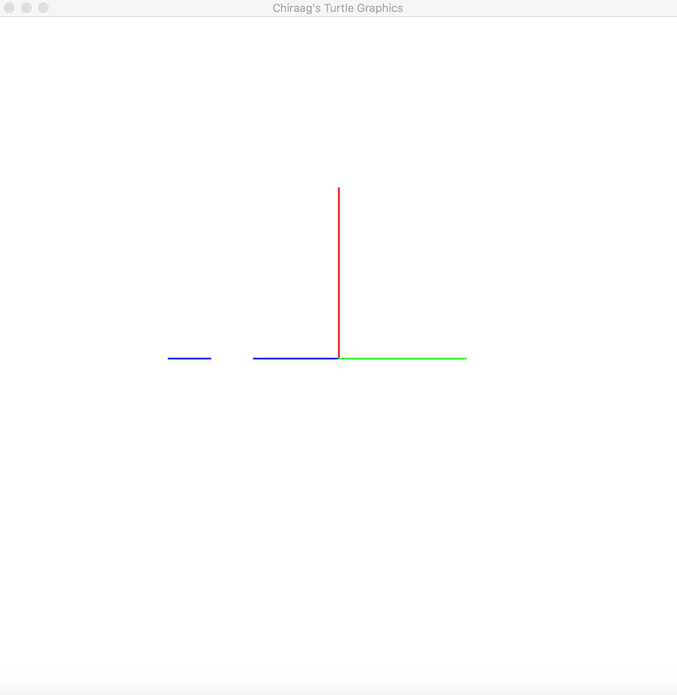

# Simple Turtle Graphics Interpreter
A simple implementation of an interpreter for a simple version of the Turtle Graphics Language. It allows users to enter programs using simple commands, and to see the appropriate graphical output on the screen. The programming exercise can be found in `tf-programming-exercise.pdf`.

## Requirements
#### Python 2.x

#### Pygame 
`$ pip install pygame` should be enough to install this library. If not then please refer to https://www.pygame.org/wiki/GettingStarted.

## Instructions
Save `chiraag_imperial_turtle.py` in your working directory.

Now simply run the script to start the interpreter

`$ python chiraag_imperial_turtle.py`

You will see a white display screen open up and a prompt `>>> ` in the terminal.

You can now enter the commands of the simple turtle graphics language and see the corresponding graphical outputs on the screen.

To exit the interpreter and the screen, type `>>> exit` and press enter.

## Turtle object
A turtle can be thought of as a point on the screen which has four attributes:

(1) **Position**: (x,y) integer coordinates of the position of the turtle on the screen. Default position is in the middle of the screen.

(2) **Direction**: A floating point number in degrees that specifies the angle with respect to north/top/up of the screen. Default direction is 0 which points to north.

(3) **Colour**: Colour of the pen held by the turtle. Acceptable colours are black, white, red, blue, and green. Default colour is black.

(4) **Pen_down**: A boolean (True or False) that specifies if the turtle is holding its pen to the screen or not. Default pen_down is True.

Note: For simplicity, I am using a dictionary instead of defining a turtle object.

## Commands
(1) `turtle` creates turtle objects as points in the middle of the screen. These points are facing north.
``` 
>>> turtle a b c
```
This will create 3 independent turtle objects called `a`, `b`, and `c` in the middle of the screen.

(2) `move` command will move a specified turtle by a specified distance in the direction in which the turtle is already facing. Also, if the pen_down attribute is True for the specified turtle then a straight line also gets drawn joining turtle's previous position and the new position using the colour of the turtle.
```
>>> move a 50
```
This will make the turtle `a` move by 50 units in the direction in which it is already facing and also draw a line if the pen of turtle `a` is down.

(3) `left` command will rotate the direction of a specified turtle anticlockwise by specified degrees.
```
>>> left b 90
```
This will make turtle `b` rotate by 90 degrees in anticlockwise direction.

(4) `right` command will rotate the direction of a specified turtle clockwise by specified degrees.
```
>>> right c 45
```
This will make turtle `c` rotate by 45 degrees in clockwise direction.

(5) `pen` command will lift the pen up or put the pen down of the specified turtle.
```
>>> pen a up
>>> pen b down
```
These commands will make turtle `a` draw its trajectory while turtle `b` won't draw its trajectory if they were to move.

(6) `colour` command will change the colour of the specified turtle to a specified colour.
```
>>> colour c green
```
This will make turtle `c` change it's colour to green

(7) `exit` command will exit the interpreter and shut the display screen.
```
>>> exit
```
## Sample Program
The following sample program draws the graphical image below:
```
$ python chiraag_imperial_turtle.py 
pygame 1.9.6
Hello from the pygame community. https://www.pygame.org/contribute.html

Welcome to Chiraag's simple turtle graphics interpreter!

Enter commands below:
>>> turtle trump boris modi
3 turtles have been created in the centre facing north.
>>> colour trump red
>>> colour boris blue
>>> colour modi green
>>> move trump 200
>>> left boris 90
>>> move boris 100
>>> right modi 90
>>> move modi 150
>>> pen boris up
>>> move boris 50
>>> pen boris down
>>> move boris 50
```


## Contact
For more details, please contact me at `clala@imperial.ac.uk`.
